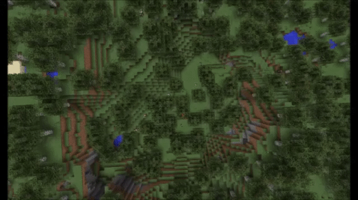

<h1 align="center"> Trails ✨ Spigot plugin </h1>  

    

## Table of Contents

- [Introduction](#introduction)
- [How to start](#how-to-start)
- [License](#license)

## Introduction

Trails is a great RPG plugin that works on the premise that, in the real world, walking wears down trails and paths from dirt to stone, eventually. Trails aims to add this element to Minecraft by automatically creating trails, paths, and roads based on the use of a trail. The trail contents and wear passes are fully configurable, unlocking the possibilities for a number of different trails or uses on your server.

## How to start
1. Install Spigot on http://www.spigotmc.org/
2. Download this plugin at https://www.spigotmc.org/resources/villagernames-%E2%9C%A8-lightweight-villager-update-1-14-1-15.76618/
3. Drop this plugin in your server's "/plugins" folder

## License
This project is licensed under the MIT license - see the [LICENSE.md](LICENSE.md) file for details.
